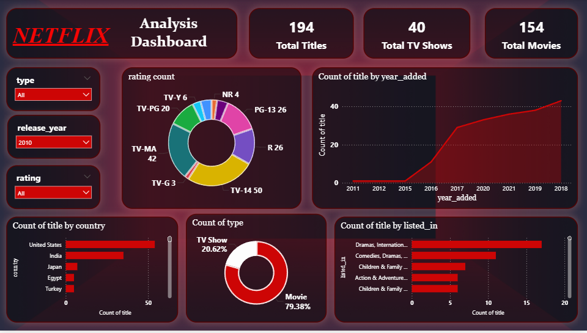

# 🎬 Netflix Analysis Dashboard – Data Analytics Report

## 📊 Project Overview
The **Netflix Analysis Dashboard** is a data analytics project created to analyze Netflix content data and extract insights about titles, genres, ratings, release trends, and country-wise content distribution.

This dashboard helps understand how Netflix content is distributed across **movies, TV shows, genres, and countries**, and how the platform has expanded its content library over time.

---

## 🎯 Objectives
The main objectives of this project are:

- Analyze the **distribution of movies and TV shows**
- Understand **content trends over time**
- Identify **popular genres on Netflix**
- Analyze **content ratings**
- Study **country-wise contribution of titles**

---

## 🛠 Tools & Technologies
- **Power BI** – Data visualization and dashboard development
- **Power Query** – Data cleaning and transformation
- **DAX (Data Analysis Expressions)** – Calculations and measures
- **Dataset** – Netflix titles dataset

---

## 📌 Key Performance Indicators (KPIs)

| Metric | Value |
|------|------|
| Total Titles | **194** |
| Total TV Shows | **40** |
| Total Movies | **154** |

These KPIs provide a quick summary of the Netflix dataset.

---

# 📈 Dashboard Analysis & Insights

## 1️⃣ Content Type Distribution

| Type | Percentage |
|------|------------|
| Movies | **79.38%** |
| TV Shows | **20.62%** |

**Insight:**  
Movies dominate the Netflix dataset, indicating that Netflix still relies heavily on movie content compared to TV shows.

---

## 2️⃣ Rating Distribution
The rating chart displays how Netflix content is categorized based on audience suitability.

Major ratings include:

- **TV-14** – 50 titles  
- **TV-MA** – 42 titles  
- **PG-13** – 26 titles  
- **TV-PG** – 20 titles  
- Other ratings include **TV-Y6, NR, PG, R**, etc.

**Insight:**  
Most Netflix content falls under **TV-14 and TV-MA**, suggesting that the platform focuses mainly on **teen and mature audiences**.

---

## 3️⃣ Content Added Over Time
The line chart shows the number of titles added to Netflix over different years.

**Key Observations:**

- Content addition remained low before **2016**
- Significant growth started around **2017**
- Netflix rapidly increased its content library after that period

**Insight:**  
This growth reflects Netflix’s aggressive expansion strategy in recent years.

---

## 4️⃣ Country-wise Content Distribution
The bar chart highlights which countries contribute the most Netflix titles.

Top contributing countries:

1. **United States**
2. **India**
3. **Japan**
4. **Egypt**
5. **Turkey**

**Insight:**  
The **United States dominates Netflix content production**, while countries like **India and Japan** are also major contributors.

---

## 5️⃣ Genre Distribution
This visualization shows the most common content categories on Netflix.

Popular genres include:

- **Dramas & International Movies**
- **Comedies & Dramas**
- **Children & Family Movies**
- **Action & Adventure**

**Insight:**  
Drama-based content appears most frequently in the dataset, making it the most dominant genre.

---

## 🎛 Dashboard Filters
The dashboard provides interactive filters to explore the dataset more effectively.

Filters available:

- **Type (Movie / TV Show)**
- **Release Year**
- **Rating**

These filters allow users to explore specific segments of Netflix content.

---

# 📊 Key Findings

- **Movies dominate Netflix content**, representing nearly 80% of titles.
- **TV-14 and TV-MA** are the most common content ratings.
- Netflix content growth accelerated significantly after **2017**.
- **United States produces the largest share of Netflix content**.
- **Drama-related genres are the most popular categories** on the platform.

---

# 🚀 Conclusion
The **Netflix Analysis Dashboard** provides valuable insights into the platform's content distribution, audience targeting, and growth trends.

Through data visualization, it becomes easier to understand:

- Content type balance
- Audience rating trends
- Geographic distribution of content
- Popular genres on Netflix

Such insights can help streaming platforms make **strategic content decisions** and improve their entertainment offerings.

---

# 🔮 Future Improvements

Potential enhancements for this project include:

- Sentiment analysis on **Netflix reviews**
- Predictive models for **popular genres**
- Content recommendation analytics
- Trend forecasting for **future content demand**

---

## 📷 Dashboard Preview

